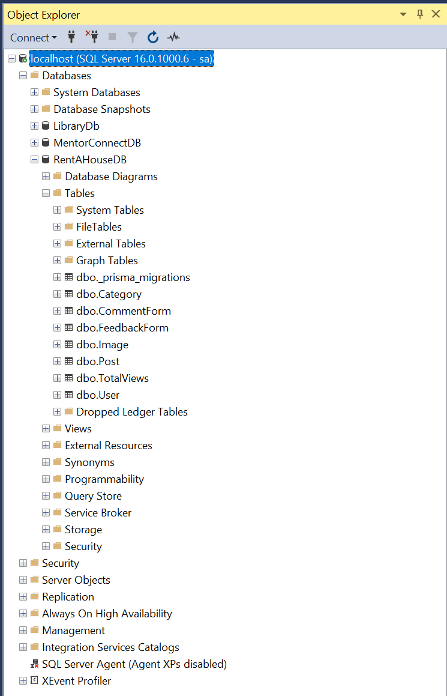

# House Rental Post Web App backend (Express.js + Prisma + SQL Server)

This is the backend for house rental post web application.  
**Express.js** is used with **SQL Server** as the database with **Prisma ORM**.

---

## Clone the Repo

```bash
git clone https://github.com/minh18ndh/house-renting-be
```

---

## Backend Setup

### Step 1: Install SQL Server

Download and install SQL Server 2022 Developer:

🔗 [Microsoft SQL Server](https://www.microsoft.com/en-us/sql-server/sql-server-downloads)

- Choose **Mixed Mode Authentication**
- Set a `username`=`sa` and `password`=`minh18`
- Enable **TCP/IP** in SQL Server Configuration Manager (by `Win` + `R` then enter `sqlservermanager16.msc`, then click `SQL Server Network Configuration` -> `Protocols for MSSQLSERVER` -> enable `TCP/IP`)
- Restart SQL Server services after setup by open `cmd` with admin privilege and run:

```bash
net stop MSSQLSERVER
net start MSSQLSERVER
```
---

### Step 2: Install SQL Server Management Studio (SSMS)

SQL Server Management Studio lets you manage tables and run queries. Download and install SQL Server Management Studio (SSMS) 20.1:

🔗 [SSMS](https://go.microsoft.com/fwlink/?linkid=2313753)

1. Open SSMS
2. Connect to `localhost` with your set up `username` and `password`

---

### Step 3: Configure `.env`

Create a `.env` file in the root folder:

```env
DATABASE_URL="sqlserver://localhost:1433;database=RentAHouseDB;user=sa;password=minh18;encrypt=true;trustServerCertificate=true"
JWT_SECRET="THIS_IS_A_SUPER_SECRET_KEY_FOR_SIGNING_TOKENS"
```

---

### Step 4: Create Database with Prisma

Open the project with VS Code (at the root of the project), then open a new terminal inside VS Code and run:

```bash
npm install
cd src
npx prisma migrate dev --name init
npx prisma generate
cd ..
npm run seed
```

---

## Run Backend Server

```bash
npm run dev
```

The API will run on:  
🔗 `http://localhost:3000`

Use Swagger UI at:  
🔗 `http://localhost:3000/docs`

---

## Important notes

- After all the steps, open SSMS to check if the RentAHouse database looks similar to this (don't mind my first 2 DBs) 
- 
- For protected routes, click `Authorize` in Swagger and paste your given JWT token after login
- Each rental post can include up to **5 images**
- Total views are tracked globally using a simple counter
- Use the PUT `/totalviews` endpoint in frontend to increase the view count on page load